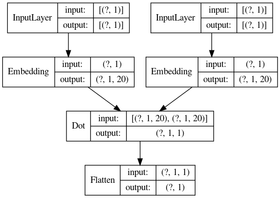

# beer_recommendation

## Beer Recommendation Model 

- Datsets : 
 https://www.kaggle.com/rdoume/beerreviews

- Using Basic Matrix Factorization recommend the beer

- model : 

- output :  
     - user / item interaction matrix 

